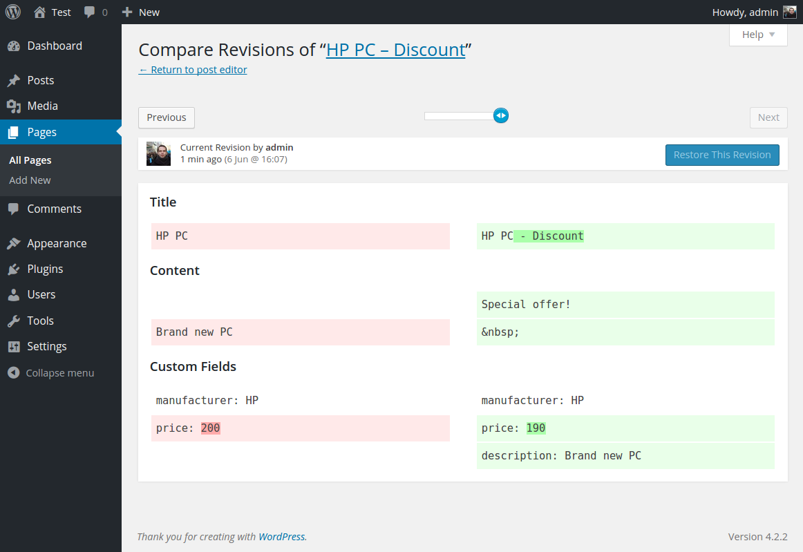

# Custom Fields Revisions for Wordpress
Enables custom fields in revisions and allows to restore them.

- Upload the entire custom-fields-revisions folder to the /wp-content/plugins/ directory.
- Activate the plugin through the 'Plugins' menu in WordPress

## Author
- [Marek Vavrecan](mailto:vavrecan@gmail.com)
- [Donate by PayPal](https://www.paypal.me/vavrecan)

## License
- [GNU General Public License, version 3](http://www.gnu.org/licenses/gpl-3.0.html)
